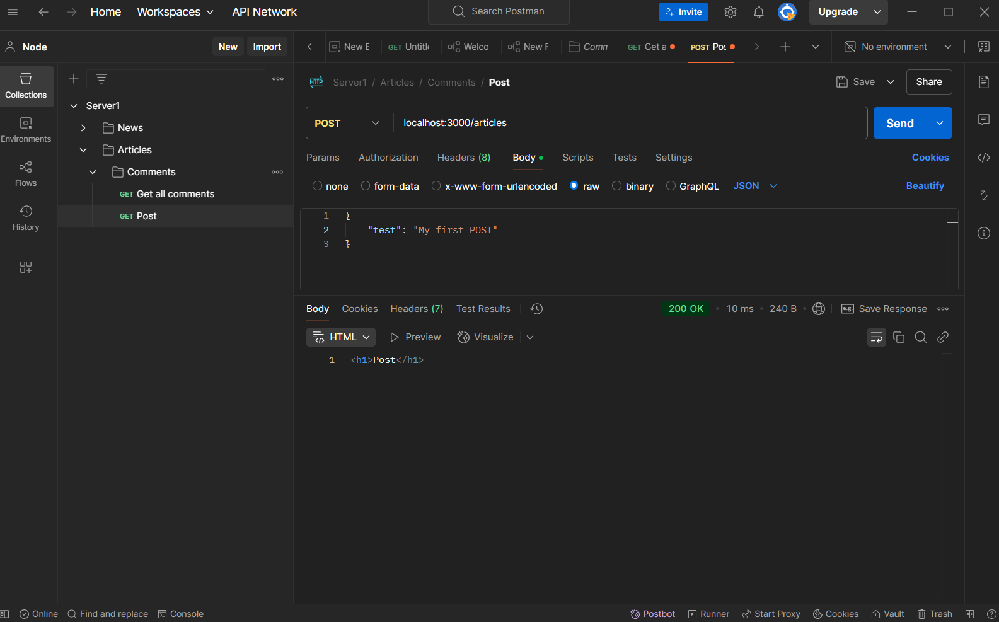

# Templating and writing APIs using the REST approach

## On-the-fly HTML generation

The first thing that comes to mind when the task of dynamic HTML generation arises is string concatenation. That is, we can add other strings with HTML tags and content inside to the base string depending on various conditions.

After the string is concatenated, it remains to pass it to the res.send() method, and we will get exactly what we wanted - dynamic HTML generation.

Let's look at the following code and try to parse it:

```js
const express = require("express");
const app = express();

const article = [
  {
    title: "First article",
    body: "Lorem ipsum dolor sit amet, consectetur adipiscing elit, sed do eiusmod tempor incididunt ut labore et dolore magna aliqua. Ut enim ad minim veniam, quis nostrud exercitation ullamco laboris nisi nisi",
  },
  {
    title: "Second article",
    body: "Lorem ipsum dolor sit amet, consectetur adipiscing elit, sed do eiusmod tempor incididunt ut labore et dolore magna aliqua. Ut enim ad minim veniam, quis nostrud exercitation ullamco laboris nisi nisi",
  },
  {
    title: "Third article",
    body: "Lorem ipsum dolor sit amet, consectetur adipiscing elit, sed do eiusmod tempor incididunt ut labore et dolore magna aliqua. Ut enim ad minim veniam, quis nostrud exercitation ullamco laboris nisi nisi",
  },
];

app.get("/articles", (req, res) => {
  let html = "";
  for (const articalData of article) {
    html += `<h1>${articalData.title}</h1>`;
    html += `<p>${articalData.body}</p>`;
  }
  res.send(html);
});

app.listen(3000);
```

We have defined a request handler that stores the HTML generation logic.

This approach is very clear, but at the same time quite cumbersome. HTML pages usually have quite a lot of HTML code, so by generating HTML in this way, your request handlers will have a lot of code to generate.

Template engines were invented to solve this problem.

### How do template engines work?

To understand how template engines work, I suggest looking at the diagram below:


- The template engine accepts a template written in a special markup language as input, in which it is possible to specify the places where data should be inserted.
- The template engine also needs to be given data as input that will replace the previously defined places for data substitution in the template.
- The template engine gives us a ready-made HTML string as output.

It turns out that to work with the template engine, you need to learn the syntax of the template markup and provide the necessary data, and the template engine itself will assemble the HTML we need for us.

> 💡 A template engine is a tool that allows you to create HTML code that is generated depending on the input data.

There are a large number of template engines for JavaScript, such as EJS, Mustache, Pug, Handlebars, etc. They all work on a similar principle, so we only need to look at one of them to understand the concept of templating in general.

### Handlebars

The Handlebars template engine can be installed using the npm install handlebars command. Once you have it installed, you need to import it into your module and start using it. Let's look at an example of using Handlebars:

```js
const handlebars = require("handlebars");
const template = handlebars.compile("{{someVar}}");
const result = template({ someVar: "Hello world!" });

console.log(result);
```

After you import Handlebars, you need to compile the template. In the example above, this happens on line 3.

The compile() method requires the template text to be passed as the first argument. In our case, it looks like this <p>{{someVar}}</p>.

Let's take a closer look at this template.
{{someVar}} in the template string is the place where the value of the variable named someVar will be substituted.

That is, if we pass a variable with the string value “Hello” to the template engine, then instead of <p>{{someVar}}</p>, we will get <p>Hello!</p> at the output.

If the variable someVar stores the number 10, then we will get <p>10</p> at the output. Thus, it turns out that any variable whose value we want to insert into our HTML must be wrapped in double curly brackets {{}}. Now let's figure out how to get the final HTML code.

The .compile() method returns a function that can be called to get the HTML code. When calling this function, you must pass in the first argument an object whose properties will be passed to the template.

```js
const result = template({ someVar: "Hello world!" });
```

> 💡 Please note! The property name must match the name of the variable expected in the template. In our case, the template expects the variable {{someVar}} and accordingly passes the someVar property in the object in the first argument of the template function.

Of course, you can pass and use as many properties as you want in the template. For example:

```js
const handlebars = require("handlebars");
const template = handlebars.compile("{{someVar}} {{someOtherVar}}");
const result = template({
  someVar: "Hello world!",
  someOtherVar: "Hello world!",
});

console.log(result);
```

### Conditional operator

You can also use conditional constructs in the template. To do this, use the following syntax:

```js
{{#if someVar}}
  <p>{{else}}</p>
{{/if}}
```

The condition begins with double curly braces and the #if operator. Then, separated by a space, the variable that will be checked for truth is specified. After that, you must specify the closing double braces. Then you must write the HTML code that will be returned in the final HTML. The condition must be closed with the {{/if}} operator, but if you want to define the HTML code that will be returned if the variable in the condition is false, then you use the {{else}} operator.

Let's look at some sample code to understand:

```js
const handlebars = require("handlebars");
const template = handlebars.compile(
  "{{#if someVar}}<p>Some text</p>{{else}}<p>Some other text</p>{{/if}}"
);
const result = template({ someVar: "Hello world!" });

console.log(template({ someVar: true }));
console.log(template({ someVar: false }));
```

### Looping through an array

Handlebars is not limited to conditionals. You can also loop through array elements. This can be very handy for those cases when you need to output some lists in HTML.

The syntax is quite simple:

```js
{{#each someArray}}
  <p>{{this}}</p>
{{/each}}
```

The iteration starts with the #each operator and the array to be iterated is specified after a space. Then, in the body of the loop, you can specify the HTML code to be output. Inside the body, you can use the {{this}} operator. This operator allows you to insert the value of the array element into the final HTML.

Let's look at how array iteration works using an example:

```js
const handlebars = require("handlebars");
const items = [
  { name: "Hello", age: 10 },
  { name: "Hello", age: 20 },
];

const template = handlebars.compile(
  "{{#each items}}<p>{{this.name}}</p>{{/each}}"
);

console.log(template({ items }));
```

### Handlebars in express

Let's create a directory templates with a file templates. In this example, the template text is moved to a separate file, which will be stored in templates/home.handlebars. This is necessary for the convenience of editing the template code and for the purity of the server code.

Now let's look at the server file [index.js](./index.js):

```js
const fs = require("fs");
const path = require("path");
const express = require("express");
const handlebars = require("handlebars");
const app = express();

const items = [
  { title: "First title", description: "Some text" },
  { title: "Second title", description: "Some text" },
];

app.get("/", (req, res) => {
  const pathToTample = path.join(__dirname, "templates/home.handlebars");

  fs.readFile(pathToTample, "UTF8", (err, data) => {
    if (err) {
      res.status(500);
      res.send(err.message);
    } else {
      const template = handlebars.compile(data);
      res.send(template({ items }));
    }
  });
});

app.listen(3000);
```

This code allows you to display a list of articles whose information is stored in an array.

In the handler body, the path to the script directory (\_\_dirname) and the path to the file where the Handlebars template is stored are combined using the .join method of the path module. This allows you to get the full path to the template file.

On line 20, the template file is loaded using the .readFile() method of the fs module.

If suddenly it was not possible to load the template file, then it is necessary to let the server users know that something went wrong. Accordingly, we determine the response status 500 (server-side error) and send the error text.

If the template text was successfully loaded, then we compile it using the handlebars.compile() method and pass it to the first argument data - this is the text from the file that was just loaded.

When the template is compiled, we call res.send() and pass the result of running the template function to the first argument, and also pass the array defined on line 8 to the template() function in an object.

Let's take a look at the [template](./templates/home.handlebars) file itself:

```Html
<!DOCTYPE html>
<html lang="en">
  <head>
    <meta charset="UTF-8" />
    <meta name="viewport" content="width=device-width, initial-scale=1.0" />
    <meta http-equiv="content-type" content="text/html; charset=UTF-8" />
    <title>Document</title>
  </head>
  <body>
    <h1>Articles</h1>
    <ul>
      {{#each items}}
        <li>
          <h2>{{this.title}}</h2>
          <p>{{this.description}}</p>
        </li>
      {{/each}}
    </ul>
  </body>
</html>
```

As you can see, the template is regular HTML text interspersed with Handlebars operators. In this case, the familiar #each operator is used to iterate over all the elements of the article array and generate the corresponding HTML. If you run the server code and make a request in the browser, you can see the following picture:


As you can see, the HTML was generated exactly as expected. If you look at the page code, you can see the result of the template engine generation.

While we were going through the example of Handlebars in Express, you might have thought that using a template engine did not make things much easier, since you need to write quite a lot of code to display such a simple page. And you would be right! In reality, such an implementation is not much simpler than string concatenation, but in fact, it is possible to simplify working with Handlebars using the express-handlebars library!

### Express-handlebars library

The express-handlebars library can be installed using the npm install express-handlebars command. Once the library is installed, you can import it in your server code and start using it.

There are some differences here compared to the previous example. Now, instead of templates, a [views](./views/) directory is defined to store Handlebars templates. Inside this directory, our [home.handlebars](./views/home.handlebars) template file is stored, as well as another layouts directory, which contains the main.handlebars file. We will look at the purpose of the layouts directory a little later, but for now, let's look at the server code:

```js
const express = require("express");
const { engine } = require("express-handlebars");

const app = express();

app.engine("handlebars", engine());
app.set("view engine", "handlebars");
app.set("views", "./views");

const items = [
  { title: "First title", description: "Some text" },
  { title: "Second title", description: "Some text" },
];

app.get("/", (req, res) => {
  res.render("home", { title: "Home", items });
});

app.listen(3000);
```

First of all, we need to import the express and express-handlebars modules.

And from express-handlebars we only need the engine method, which is extracted using JavaScript object destructuring.

Next comes a number of important initializations. First of all, we create the express application on the fourth line.

Next, on the sixth line, the express .engine() application method is used. This method is necessary to register the template engine. Express can work with many template engines, you can read about this in [this documentation](https://expressjs.com/ru/guide/using-template-engines.html).

Next, on the seventh line, the default template engine is defined using app.set() method.

> 💡 app.set() is a method that allows you to store any property in the express application that you want and retrieve it using the app.get() method, but there are a number of reserved properties that need to be used for application configuration. The first argument of the method is the name of the property, and the second is the value of the property. You can read more about this method in the [express documentation](https://expressjs.com/ru/api.html#app.set).

The view engine property allows express to understand which template engine should be used by default. The value of this property must be set to handlebars.

The eighth line defines the views property - this is the path to the directory where the templates will be stored. The value must be set to ./views.

On line 10, the array that will be used as data for the template is defined. This is the same array that was in the previous example.

Now let's look at the request handler.

Here, the res.send() method is no longer used, but the .render() method is used. This method allows you to define in the first argument which template to use, and in the second argument, what data will be passed to the template.

In our case, the template name is home, since the home.handlebars template is stored in the views directory. The file extension can be omitted. The title property is passed to the second argument. The value of this property will be used as the page title. An array of articles is also passed, which will be used in the template to generate the list.

Now let's look at the [./views/home.handlebars](./views/home.handlebars) template

Here you can see the already familiar code for generating the list of articles. But there is no basis of the html page: the <head/> and <body/> tags. This is not without reason, since all this code is “hidden” in the [./views/layouts/main.handlebars](./views/layouts/main.handlebars) file.

The ./views/layouts/main.handlebars file is the base for all templates. The code for any template will be inserted into the place where the special {{{body}}} operator is defined. This approach allows you to avoid writing the same code several times, and concentrate on writing the changing part of the page.

Handlebars by default looks for the main.handlebars file in the ./views/layouts directory, but you can override the template layer during the call to the res.render() function by passing the ‘layout’ property with the template name in the second argument in the object.

For example, if you create a file ./views/layouts/index.handlebars, then to use it when calling a function, you need to pass information like this:

```js
app.get("/", (req, res) => {
  res.render("home", { layout: "index", title: "Home", items });
});
```

That is, next to the information that the template needs to generate a list of articles, layout: ‘index’ is also passed.

## API

In the context of web servers, there are several approaches, but we will consider the most popular and at the same time simple income - REST.

### REST

REST is a set of rules for inter-service communication on the web. Let's look at two of the most important rules in this approach:

- The URL must contain information about the object we are working with
- The routes you implement must use the GET, POST, PUT, DELETE methods - these are the actions we want to perform on objects

Now I suggest we look at these rules in more detail.

The URL must contain information about the object. This means that in the URL we must use only nouns and avoid using verbs and adjectives. Also, in addition to nouns, the URL must use object identifiers to work with specific objects. The URL must consist of segments, where each individual element is either an object or an identifier, for example: /object_1/identifier/object_2/identifier.

The GET, POST, PUT, DELETE methods are actions on objects. Since the URL stores information about the object we are working with, the request method is an action on this object. GET is getting information about an object, POST is creating a new object, PUT is updating an existing
object, and finally DELETE is deleting an object.

Let's look at an example in which we work with article objects:

- GET /articles/3 - get the article with the ID three. Here, the first segment of the URL is the article object, and the second segment is the ID of a specific article
- GET /articles - get all article objects. Since there is no ID here, this is considered as getting all the specified objects. Note that the article object is defined in the plural because sometimes we need to get
  several objects at once.
- POST /articles - create an article. Here, we specify in the URL the object that we want to create without specifying an ID, since before creating it, we do not yet know what ID the article will have. Usually, IDs are unique and are created by the server during creation, and we do not need to specify it manually.
- PUT /articles/3 - update the third article. Here we intentionally specify the ID of a specific article, since without it it is not clear which specific article we want to update.
- DELETE /articles/3 - delete the third article. Just like with the update, you need to specify using the ID which article you want to delete.

It often happens that objects depend on each other. In this case, the URL must respect this dependency. For example, each article has comments that are tied to a specific article. You cannot create a comment to one article and look in another. To implement such a dependency in REST, you must do the following:

- GET /articles/3/comments - get a list of comments for the third article.
- GET /articles/3/comments/1 - get the first comment for the third article.
- POST /articles/3/comments - create a comment for the third article.
- PUT /articles/3/comments/1 - update the first comment for the third article.
- DELETE /articles/3/comments/1 - delete the first comment for the third article.

#### Postman

Postman is a regular program that is installed like any other regular program. So after downloading, you just need to run the installation file and follow the instructions of the installer program.

All requests can be saved and returned to as needed. The storage place for requests in Postman is collections. A collection is a way to store and group requests. There can be several collections. Usually, a separate collection is created for one server.

In each collection, you can create directories, similar to a file system. This is necessary in order to separate queries in the collection by entities. For example, one directory for queries related to articles, another directory for queries related to comments. Directories can be created in other directories.


In the screenshot, a GET request named Get all comments was created in the Comments directory All requests are created with the GET method by default, but it can be changed in the drop-down list.

The URL must be entered in the input line, just like in a browser.

To make a request, you need to click on the Send button, or press the Enter key.


### Implementing API in Express

#### POST method

Let's start with the POST method. Below is an example of using the POST method:

```js
const express = require("express");

const app = express();

app.post("/articles", (req, res) => {
  res.send("<h1>Post</h1>");
});
```

Looking at the code example, you can see that the POST method is implemented in the same way as the GET method. If you make a request to this URL “/” with the POST method, you will receive an HTML header in response. But there is a nuance: the POST method allows you to accept the request body, unlike GET. In order to start accepting the request body, you need to connect the express.json() intermediate handler. After you do this, in the req request object you will be able to receive the transmitted request body.

Let's look at an example:

```js
const express = require("express");

const app = express();

app.use(express.json());

app.post("/articles", (req, res) => {
  console.log(req.body);
  res.send("<h1>Post</h1>");
});

app.listen(3000);
```

To test the code, you need to create a new request in Postman, select the POST method from the list of methods, and specify localhost:3000 as the URL. To define the request body in JSON format, you need to select the Body tab under the address bar, then select raw in the drop-down list, and then select JSON in the drop-down list next to it.


Let's make a request regarding our example with [api.js](./api.js)



In the console you should see something like this:

```Console
{ test: 'My first POST' }
```

#### PUT method

The PUT method is implemented in a very similar way to the POST method, only the Express method called differs.

```js
const express = require("express");

const app = express();

app.put("/articles", (req, res) => {
  console.log(req.body);
  res.send("<h1>Put</h1>");
});

app.listen(3000);
```


In the console you should see something like this:

```Console
{ test2: 'Testing PUT' }
```

#### DELETE method

There are no surprises with the DELETE method. It is implemented in a similar way to the previous methods.

```js
const express = require("express");

const app = express();

app.delete("/articles", (req, res) => {
  console.log(req.body);
  res.send("<h1>Delete</h1>");
});

app.listen(3000);
```

> 💡 The DELETE method can also accept a request body, but there is one caveat: in REST, the DELETE method usually does not accept a request body, since information about the object being deleted is stored in the URL.

### Implementing an API for managing articles

We will try to implement an [API](./articles_app/) that will allow you to receive, create, update and delete articles. You may have a question: how will the articles be stored? In this lecture, we will not use databases, so we will store articles in a JavaScript array and information about the articles will be stored as long as our server is running. This approach will allow you not to be distracted by the details of working with the database and focus on implementing the API.

#### Route for getting all articles

Let's start with the route for getting all articles. We already know that in REST, the URL must specify the object we are working with, and the HTTP method is an action on the object. Therefore, we need to implement the following route: GET /articles.

The handler for this route will return an array of articles. In code, it will look like this:

```js
const express = require("express");

const app = express();
const articles = [];

app.use(express.json());

app.get("/articles", (req, res) => {
  res.send(articles);
});

app.listen(3000);
```

#### Article creation route

This is a bit more complicated. It is necessary to implement a route that will receive a JSON object with information about the article in the request body, and in the handler it is necessary to add this object to the articles array. There is also an important nuance - this is the article identifier. Each article must have a unique identifier, so that it is possible to receive, update and delete an article by this identifier. It is also important to understand that the identifier must be generated and ensured by the server itself. If we shift this responsibility to the user of our server, then there is a high probability that the user will make a mistake in generating identifiers and collisions may arise. For example, the user will create two articles with the same identifier and then it will be impossible to fully manage these articles.

Before you start writing the code, you need to decide what data will be stored in the article object. For simplicity, we will assume that the article object will consist of two text fields: title and content, as well as an id field with an identifier.

```js
{
    "id": 1,
    "title": "First article",
    "content": "Lorem ipsum dolor sit amet, consectetur adipiscing elit, sed do eiusmod tempor incididunt ut labore et dolore magna aliqua. Ut enim ad minim veniam, quis nostrud exercitation ullamco laboris nisi nisi"
}
```

Let's look at a part of our server code with the implementation of the handler for creating articles:

```js
let uniqueID = 0;

app.post("/articles", (req, res) => {
  uniqueID += 1;
  articles.push({
    // Corrected to articles
    id: uniqueID,
    ...req.body,
  });

  res.send({
    id: uniqueID,
  });
});
```

In Postman, a request to create an article should look something like this:

```
{
    "title": "First article",
    "content": "Lorem ipsum dolor sit amet, consectetur adipiscing elit, sed do eiusmod tempor incididunt ut labore et dolore magna aliqua. Ut enim ad minim veniam, quis nostrud exercitation ullamco laboris nisi nisi"
}
```


Let's create several post requests and make sure that the data is displayed correctly in the browser:


#### Article retrieval route

Now let's try to implement a route that will return information on a specific article. To do this, you need to implement a route that will accept an article ID in the URL, then search for the required article in the article array and return the found object. If nothing was found by the passed ID, you need to complete the request with the 404 response code. Let's look at the code:

```js
// Handler for a GET request to get a specific article by ID
app.get("/articles/:id", (req, res) => {
  const { id } = req.params; // Get the ID from the URL parameters
  const article = articles.find((article) => article.id == id); // Search for an article by ID

  if (!article) {
    return res.status(404).send({ error: "Article not found" }); // Return 404 if not found
  }

  res.send(article); // Return the found article
});
```


#### Article update route

To update an article, we need to accept the ID of the article to update in the request URL and then use this ID to find the desired article in the array. Next, we need to update the article object in the array based on the information passed in the request body. Let's look at the code:

```js
app.put("/articles/:id", (req, res) => {
  const { id } = req.params; // Get ID from URL parameters
  const articleIndex = articles.findIndex((article) => article.id == id); // Find article index in array

  if (articleIndex === -1) {
    return res.status(404).send({ error: "Article not found" }); // Return 404 if not found
  }

  // Update article with new data
  articles[articleIndex] = {
    ...articles[articleIndex], // Save existing data
    ...req.body, // Update with data from request body
  };

  res.send(articles[articleIndex]); // Return updated article
});
```


#### Route to delete an article

To delete an article, you need to accept the article ID in the request URL, find the desired article in the array, and delete its object from the array. Let's look at the code:

```js
// Handler for DELETE request to delete an article
app.delete("/articles/:id", (req, res) => {
  const { id } = req.params; // Get ID from URL parameters
  const articleIndex = articles.findIndex((article) => article.id == id); // Find article index in array

  if (articleIndex === -1) {
    return res.status(404).send({ error: "Article not found" }); // Return 404 if not found
  }

  articles.splice(articleIndex, 1); // Delete article from array
  res.send({ message: "Article deleted successfully" }); // Return message about successful deletion
});
```


### Joi Validator

To validate the data, we will use the Joi library. To install the library, simply type npm install joi in the console. After installation, you can import this library and start using it.

Let's look at how Joi works, for now, without an HTTP server:

```js
const Joi = require("joi");
const schema = Joi.string();

const result = schema.validate("Hello world!");

console.log(result);
```

If validation is successful, the .validate() method returns an object in which the original value that was validated is stored in the value field. But what if the data does not pass validation?

Joi will add an error field to the object in addition to value, which stores information about the error. To get a specific error message, you can refer to the result.error.details field. This field stores an array of all errors:

```js
const Joi = require("joi");
const schema = Joi.string();

const result = schema.validate("Hello world!");

console.log(result.error?.details);
```

How to validate other types of data? Let's look at an example of validating an article object:

```js
const Joi = require("joi");
const schema = Joi.object({
  id: Joi.number().required(),
  title: Joi.string().required(),
  content: Joi.string().required(),
});

const result = schema.validate({
  id: 1,
  title: "First article",
  content:
    "Lorem ipsum dolor sit amet, consectetur adipiscing elit, sed do eiusmod tempor incididunt ut labore et dolore magna aliqua. Ut enim ad minim veniam, quis nostrud exercitation ullamco laboris nisi nisi",
});

console.log(result.error?.details);
```

#### Using Joi in Express

Now let's try using Joi in our server code, specifically in the article creation handler:

```js
app.post("/articles", (req, res) => {
  const { error } = articleSchema.validate(req.body); // Validate data

  if (error) {
    return res.status(400).send({ error: error.details[0].message }); // Return validation error
  }

  uniqueID += 1;
  articles.push({
    id: uniqueID,
    ...req.body,
  });

  res.send({
    id: uniqueID,
  });
});
```

To make the code more readable, it is necessary to split it into several files: [scheme.js](./articles_app/scheme.js), [validate.js](./articles_app/validate.js) and [server.js](./articles_app/server.js)

Our server is almost ready! It allows you to receive, create, update and delete articles. The validator also limits the user when working with articles and we can be sure that the user will not break our server by transmitting invalid data. All that remains is to add a global intermediate handler for non-existent routes. You are already familiar with how to handle such cases. In our server, the code for handling non-existent routes will look like this:

```js
app.use((req, res) => {
  res.status(404).send({ error: "Not found" });
});
```

In order for users to be stored permanently, and not only when the server is running, it is necessary to implement storing the array in a file.

We will use a JSON file to store articles. Let's create a file that will store an array of articles.

```js
// Function for loading articles from file
const loadArticles = () => {
  if (fs.existsSync(articlesFilePath)) {
    try {
      const data = fs.readFileSync(articlesFilePath);
      articles = JSON.parse(data); // Loading articles from file
    } catch (err) {
      console.error("Error loading articles:", err.message);
      articles = []; // If an error occurred, initialize an empty array
    }
  }
};

// Function for saving articles to a file
const saveArticles = () => {
  fs.writeFileSync(articlesFilePath, JSON.stringify(articles, null, 2)); // Save articles to a file
};

let uniqueID =
  articles.length > 0 ? Math.max(...articles.map((article) => article.id)) : 0; // Set a unique ID

// Load articles when the server starts
loadArticles();
```

Let's add a template engine to display and work with our articles in the browser as we did before. We will also need a [helper](./articles_app/helpers.js) to implement template inheritance. In Handlebars, you need to implement this manually:

```js
const Handlebars = require("handlebars");

// Helper for extending templates
Handlebars.registerHelper("extend", function (name, options) {
  // Save content in a variable
  const content = options.fn(this);

  // Return content for the layout
  return content;
});
```

Let's also add styling to our project. To do this, create a Public folder inside which will be a CSS folder with a style style.css.

In our server.js file, we'll add code to configure Express to serve static files:

```js
app.use(express.static("Public"));
```

All that remains is to include the CSS file in the [main.handlebars](./articles_app/views/layouts/main.handlebars) file.

So our application now looks like this:


And all articles are saved to the [articles.json](./articles_app/articles.json) file.
