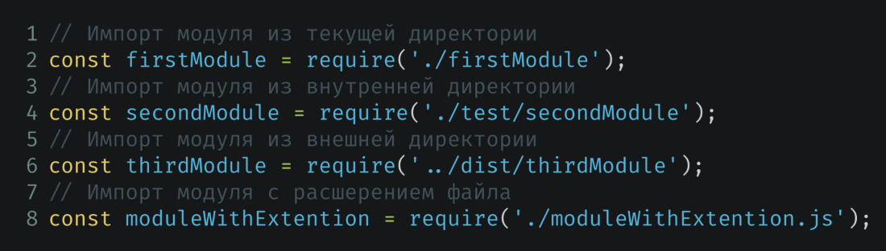
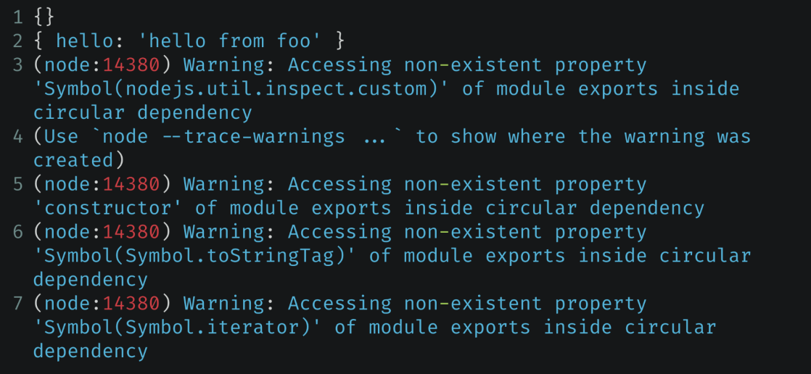

# Introduction to built-in modules and the Express framework

## Modules

In order to split a Node.js project into multiple files, you need to understand how modules export and import data. You are already partially familiar with the require() function and the global module.exports object. Let's take a closer look at how they work. Before we begin, let's define a module:

> 💡 A module is a file whose code can be used in other modules.

There are three types of modules:

- Built-in modules – these modules are part of Node.js, such as the http module.
- NPM modules – these modules can be installed using NPM.
- Custom modules – these are modules that you create yourself.

### Exporting data from a module

Any module can export some data so that it can be reused in another module. If you imagine a module as a regular function, then exporting from a module is an analogue of the return operator. That is, the module returns some values ​​during the import of this module. In Node.js, exporting from a module is implemented through the already familiar global object module.exports.

```js
function myModule() {
  const myValue = 10;
  const myFunction = () => {
    console.log(myValue);
  };
  return {
    myValue,
    myFunction,
  };
}

module.exports = myModule();
```

You can export any data type from a module: functions, strings, numbers, arrays, and objects. By default, module.exports is an empty object. In the example above, we overridden this empty object with another object with different properties. Now you can import this module in another module and use these properties at your discretion.

You need to remember one rule - export must happen immediately! Let's look at this rule with an example:

```js
setTimeout(() => {
  const someVar = 10;
  module.exports = { someVar };
}, 0);
```

module.exports is defined in the setTimeout callback. Since setTimeout is an asynchronous function, the callback will be executed in the future. This means that as soon as we import a module with such code, we will not receive the necessary data in module.exports, they will be defined a little later. This is why you cannot use module.exports in asynchronous functions.

Here's another example where export won't work:

```js
function exportInFunction() {
  const someVar = 10;
  module.exports = { someVar };
}
```

Here it is generally clear why it will not be possible to export data, since the function is not called. If the function is called, the data will be exported:

```js
function exportInFunction() {
  const someVar = 10;
  return { someVar };
}

exportInFunction();
```

> 💡 A good way to export data from a module is to define module.exports at the end of the script.

### Import modules

> 💡 The require() function is a global Node.js function that is used to load and cache modules. It takes one argument - the name or file path of the module to load, and returns the exported properties from that module.

Let's look at some examples of different imports:

```js
const http = require("http");
const myModule = require("./myModule.js");
const { myValue, myFunction } = require("./myModule.js");
const myModule = require("./myModule.js").myModule;
```

The require() function can take as an argument the name of a module if it is a global or NPM module, or the path to the module if it is a user module.

The require() function works as follows:

1. The require() function first searches for built-in modules by the passed module name.
2. If there is no global module with the specified name, then require() searches for installed modules using NPM.
3. And finally, if there is neither a global nor an NPM module, or the path to the module is specified, then it searches among user modules.

This is a simplified algorithm of the function. If you want to get acquainted with the algorithm in more detail, you can refer to the [official documentation](https://nodejs.org/api/modules.html#all-together).

### Custom modules

As we have already found out, you can create your own modules. In fact, these are separate files in the project. To import a custom module, just specify the path to the file in the require() function argument:

```js
const myModule = require("./myModule.js");
```

Please note that the path to the module is specified relative to the module in which we import. You can also omit the module file extension, require() will automatically substitute the extension if it is missing.

Also, require() allows you to import a directory instead of a file. To do this, you must specify the path to the directory and the directory must contain the index.js file:



The path to the module is specified relative to the module in which we import. You can also omit the module file extension, require() will automatically substitute the extension if it is not there.

Also, require() allows you to import a directory instead of a file. To do this, you need to specify the path to the directory and the directory must contain the index.js file:

```js
// ./myLib/index.js
module.exports = { hello: "hello" };

// main.js
const myLib = require("./myModule");
```

Above is an example of how you can import a directory. The myLib directory contains an index.js file that exports an object with the hello property.

This directory is imported in the main.js file and the path to the directory of the imported module is specified in require().

Such import can be useful when you implement, for example, a library that is divided into several files. In order not to think about which specific file to specify when importing, you can simply create a directory and define an index.js file in it, which will be used for import by default and simply specify the path to the directory when importing.

### Import by chain

It is important to understand that imported modules can also import other modules into themselves. Below is an example of an import chain:

The first module in this chain is the baz module, which does not import anything, but exports data:

```js
// baz.js

module.exports = "hello from baz";
```

The second module is the foo module, which imports the baz module and exports its own data.

```js
// foo.js

const baz = require("./baz");

console.log(baz);

module.export = "Hello from foo";
```

And the third module is the index module, which imports the foo module.

```js
// index.js

const foo = require("./foo");

console.log(foo);
```

#### Cyclic dependencies

Sometimes situations may arise where a dependency chain starts and ends on the same file. This is called circular dependencies.

```js
// foo.js

const baz = require("./baz");

console.log(baz);

module.export = { hello: "hello from foo" };
```

Let's say there is a module foo.js that imports a module baz.js. In this case, foo.js exports an object with a property hello.

```js
// baz.js

const foo = require("./foo");

console.log(foo);

module.exports = { hello: "hello from baz" };
```

And there is a baz.js module that imports the foo.js module and exports an object with a hello property.

If we run the foo.js module, we will get something like this output in the console:



The first line will output an empty object, the second will output an object that is exported from the foo.js module, and then we will see a warning text that says that there are cyclic dependencies in the code.

Why didn't we get an object that has the text "hello from baz" in the hello property, but instead got an empty object?
When the foo.js module is launched, it immediately imports the baz.js module. baz.js, in turn, imports foo.js and outputs the foo.js module export to the console. Since the foo.js module has not yet been initialized, require() in baz.js returns an empty
export object (the default value). That is why we saw an empty object in the console.

Such dependencies should be avoided, as they break the code.

## Global objects and functions

For convenience, some Node.js functionality is not implemented in a separate module, but is provided globally. What does this mean?

Global objects and functions in Node.js are objects and functions that are available in all modules without the need to include them using require().

For example, console, process, and \_\_dirname, etc. They are part of the Node.js runtime and are defined as global objects and functions for convenience.

To use global objects and functions in Node.js, you just need to refer to them by name. For example:

```js
console.log(process.cwd());

const fs = require("fs");
```

### Global objects

In Node.js, there is a global object called global. This object stores various objects and functions, such as console, Math, setTimeout, etc.

Here you may be confused, since console can be called from anywhere and there is no need to access global. Yes, that's right! This is possible because the global object is written to the global context when the script starts, and that is why
all its properties and functions are available without accessing the global object itself. But nothing prevents you from accessing through global, for example, like this:

```js
global.Math.Floor(0.5);
// Same as
Math.Floor(0.5);

global.SetTimeout(() => console.log("Hello"), 1000);
// Same as
setTimeout(() => console.log("Hello"), 1000);
```

### Process object

There is also a process object in Node.js. It contains a set of functions and properties for working with the operating system and the running Node.js process.

```js
process.cwd(); // Current working directory
process.env; // Environment variables
process.exit(); // Exit the process
process.memoryUsage(); // Memory usage
process.nextTick(); // Execute a function after the current event loop cycle
process.title; // Process title
process.version; // Node.js version
```

### **dirname and **filename properties

In order to determine the path in the file system to the same script from a script, you can use two properties: **dirname and **filename.

```js
console.log(__dirname); // /home/user/project
console.log(__filename); // /home/user/project/index.js
```

Note the difference between process.cwd() and **dirname. At first glance, they seem to do the same thing, but there is actually a significant difference: process.cwd() returns the path to the directory from which the script was launched, while **dirname returns the directory where the script is stored.

## Built-in Node.js modules

You already know that built-in modules are installed with Node.js and do not need to be installed separately. Built-in modules provide various capabilities for working with files, networks, operating systems, streams, events, cryptography, and other aspects of Node.js programming. You are already familiar with the http module, and in this lecture we will look at three more useful modules - these are the fs, path, and os modules.

### fs Module

The fs (file system) module provides functions for working with the file system.

It can be used to read, write, delete, and move files and directories. After connecting the module, we can use its methods to work with files.

### Method fs.readFile()

For reading files, there is a method fs.readFile(). It allows you to get the contents of any file:

```js
const fs = require("fs");

fs.readFile("./file.txt", (err, data) => {
  if (err) throw err;
  console.log(data.toString());
});
```

The fs.readFile() method is asynchronous, meaning it does not block the execution of other code until it has read the file. Instead, it passes the result of reading the file to a callback function that will be called later.

### Method .writeFile()

For writing files, there is a method fs.writeFile(). It allows you to write to any file:

```js
const fs = require("fs");

fs.writeFile("./file.txt", "Hello world", (err) => {
  if (err) throw err;
  console.log("The file has been saved!");
});
```

### Method fs.copyFile()

For copying files, there is a method fs.copyFile(). It allows you to copy any file:

```js
const fs = require("fs");

fs.copyFile("./file.txt", "./file2.txt", (err) => {
  if (err) throw err;
  console.log("The file has been copied!");
});
```

### Method fs.unlink()

For deleting files, there is a method fs.unlink(). It allows you to delete any file:

```js
const fs = require("fs");

fs.unlink("./file.txt", (err) => {
  if (err) throw err;
  console.log("The file has been deleted!");
});
```

### Method fs.mkdir()

For creating directories, there is a method fs.mkdir(). It allows you to create any directory:

```js
const fs = require("fs");

fs.mkdir("./folder", (err) => {
  if (err) throw err;
  console.log("The folder has been created!");
});
```

### Method fs.rmdir()

For deleting directories, there is a method fs.rmdir(). It allows you to delete any directory:

```js
const fs = require("fs");

fs.rmdir("./folder", (err) => {
  if (err) throw err;
  console.log("The folder has been deleted!");
});
```

### Method fs.readdir()

For listing files in a directory, there is a method fs.readdir(). It allows you to list any directory:

```js
const fs = require("fs");

fs.readdir("./folder", (err, files) => {
  if (err) throw err;
  console.log(files);
});
```

### Method fs.stat()

For getting information about a file or directory, there is a method fs.stat(). It allows you to get information about any file or directory:

```js
const fs = require("fs");

fs.stat("./file.txt", (err, stats) => {
  if (err) throw err;
  console.log(stats);
});
```

### Method fs.watch()

For watching files and directories for changes, there is a method fs.watch(). It allows you to watch any file or directory for changes:

```js
const fs = require("fs");

fs.watch("./file.txt", (eventType, filename) => {
  console.log(eventType, filename);
});
```

### Method fs.watchFile()

For watching files and directories for changes, there is a method fs.watchFile(). It allows you to watch any file or directory for changes:

```js
const fs = require("fs");

fs.watchFile("./file.txt", (curr, prev) => {
  console.log(curr.mtime, prev.mtime);
});
```

### fs.appendFile() method

For appending data to a file, there is a method fs.appendFile(). It allows you to append data to any file:

```js
const fs = require("fs");

fs.appendFile("./file.txt", "Hello world", (err) => {
  if (err) throw err;
  console.log("The file has been appended!");
});
```

### fs.createReadStream() method

For reading files in chunks, there is a method fs.createReadStream(). It allows you to read any file in chunks:

```js
const fs = require("fs");

const readStream = fs.createReadStream("./file.txt");

readStream.on("data", (chunk) => {
  console.log(chunk.toString());
});
```

### fs.createWriteStream() method

For writing files in chunks, there is a method fs.createWriteStream(). It allows you to write any file in chunks:

```js
const fs = require("fs");

const writeStream = fs.createWriteStream("./file.txt");

writeStream.write("Hello world");
writeStream.end();
```

## Path module

The path module provides functions for working with file paths.

### Method path.join()

For joining paths, there is a method path.join(). It allows you to join any number of paths:

```js
const path = require("path");

console.log(path.join(__dirname, "file.txt"));
```

### Method path.basename()

For getting the base name of a path, there is a method path.basename(). It allows you to get the base name of any path:

```js
const path = require("path");

console.log(path.basename("/home/user/project/index.js"));
```

### Method path.extname()

For getting the extension of a path, there is a method path.extname(). It allows you to get the extension of any path:

```js
const path = require("path");

console.log(path.extname("/home/user/project/index.js"));
```

### Method path.parse()

For parsing a path, there is a method path.parse(). It allows you to parse any path:

```js
const path = require("path");

console.log(path.parse("/home/user/project/index.js"));
```

### Method path.format()

For formatting a path, there is a method path.format(). It allows you to format any path:

```js
const path = require("path");

console.log(
  path.format({
    dir: "/home/user/project",
    base: "index.js",
  })
);
```

## os module

The os module provides functions for working with the operating system.

### Method os.hostname()

For getting the hostname of the operating system, there is a method os.hostname(). It allows you to get the hostname of the operating system:

```js
const os = require("os");

console.log(os.hostname());
```

### Method os.platform()

For getting the platform of the operating system, there is a method os.platform(). It allows you to get the platform of the operating system:

```js
const os = require("os");

console.log(os.platform());
```

### Method os.arch()

For getting the architecture of the operating system, there is a method os.arch(). It allows you to get the architecture of the operating system:

```js
const os = require("os");

console.log(os.arch());
```

### Method os.cpus()

For getting information about the CPU of the operating system, there is a method os.cpus(). It allows you to get information about the CPU of the operating system:

```js
const os = require("os");

console.log(os.cpus());
```

### Method os.networkInterfaces()

For getting information about the network interfaces of the operating system, there is a method os.networkInterfaces(). It allows you to get information about the network interfaces of the operating system:

```js
const os = require("os");

console.log(os.networkInterfaces());
```

### Method os.uptime()

For getting the uptime of the operating system, there is a method os.uptime(). It allows you to get the uptime of the operating system:

```js
const os = require("os");

console.log(os.uptime());
```

## What other modules exist?

- url – allows you to work with URL addresses and their components;
- crypto – allows you to work with cryptography. Contains various cryptographic functions;
- stream – allows you to manage large data streams.

And many other modules.

## Introduction to express

Express is a popular web framework for Node.js. It provides a set of features for building web applications, such as routing, middleware, and templating. Express is built on top of Node.js and is used by many popular web applications, such as Facebook, Twitter, and GitHub.

### Difference between Express and built-in http package

Express is built on top of the built-in http package, which provides low-level functions for working with the HTTP protocol. Express extends and simplifies the capabilities of the http package by adding high-level abstractions and convenient methods for creating web applications. For example, with Express, you can easily create an http server like this:

```js
const express = require("express"); // Connecting the module

const app = express(); // Create an application object

// Create a Get handler for the root path
app.get("/", (req, res) => {
  res.send("Hello world");
});

// Launching the server
app.listen(3000, () => {
  console.log("Server is running on port 3000");
});
```

Express allows you to:

- Use app.get(), app.post(), etc. to define request handlers for different HTTP methods and URL paths.
- Use res.send() to send a response with automatic content-type and encoding detection.
- Use app.listen() to start a server on a specified port.

In addition, Express provides many other features, such as:

- Support for parameters in URL paths. For example, if you want to define
  a part of the URL as a variable part.
- Support for static files and template engines.
- Support for intermediate handlers to perform various tasks before or after a request is processed.
- Support for routers to organize handlers into groups or
  modules.
- Support for error handling and special responses (e.g. 404).

Express thus makes working with HTTP servers on Node.js much easier and better than the built-in http package.

## Installing and running Express

To use Express in your project, you need to install it as a dependency using NPM. To do this, run the following command in the terminal:

```Bash
npm install express
```

This command will install Express in the node_modules folder and add it to the package.json file in the dependencies section.

To use Express in your code, you need to import it using the require() function and create an application instance using the express() function:

```js
const express = require("express");
const app = express();
```

An app instance is an object that contains methods for configuring and starting the server, as well as for defining request handlers.

Next, you need to start the server using the app.listen() method. This method works the same way as the .listen() method of the built-in http module. To start, you need to pass the port number on which the server will listen to the .listen() method argument.

```js
const express = require("express");
const app = express();

app.listen(3000);
```

Now you can define HTTP handlers. This is done by calling the .get(), .post(), .put(), .delete(), etc. methods on the app object.

```js
const express = require("express");
const app = express();

app.get("/", (req, res) => {
  res.send("Hello world");
});

app.listen(3000);
```

You can define handlers either before or after calling the .listen() method. It will work the same way in most cases. But it is better to define handlers before starting the server to avoid cases when the server is running, but the handlers have not yet been initialized.

Express allows you to define multiple handlers. For example, we can define a handler for the /about route:

```js
const express = require("express");
const app = express();

app.get("/", (req, res) => {
  res.send("Hello world");
});

app.get("/about", (req, res) => {
  res.send("About");
});

app.listen(3000);
```

## req and res objects

Let's now take a closer look at the callback in the third argument. This callback is executed when a request arrives and in the arguments of this callback we can get two objects.

The first object is the req (request) object. This object stores information about the request, such as: request url, request method, client information, etc.

The second object is the res (response) object. This object stores properties and methods that allow you to work with the response. For example, the .send() method allows you to complete the request and specify the data that needs to be returned to the client, and the .status() method allows you to specify the http status of the response.

## Intermediate handlers

Express has a concept of intermediate handlers or middleware.

Such handlers are needed to set additional logic for the main handlers.

There are two types of intermediate handlers: global and local.

- Global intermediate handlers are not tied to a specific route and work for a group of routes or absolutely for all routes.
- Local intermediate handlers are defined for a specific route.

### Global middleware

Let's look at the work of global intermediate handlers using an example:

```js
const express = require("express");
const app = express();

app.use((req, res, next) => {
  console.log("Global handler");
  next();
});

app.get("/", (req, res) => {
  res.send("Hello world");
});

app.get("/about", (req, res) => {
  res.send("About");
});

app.listen(3000, () => {
  console.log("Server is running on port ${port}");
});
```

Let's say we want to log every incoming request. To avoid writing logging logic in each route, we can add a global intermediate handler before defining all the routes.

This is implemented using the app.use() method. On the sixth line, you can see that the method takes a single argument in the form of a callback, which is very similar to a callback in a regular handler.

In the first argument, you can get the request object, in the second - the response object, and the third argument stores the next() function.

The next() function is needed to continue calling the next handlers. If the next() function is not called, the route handlers will not run and the request will hang. That is, in the intermediate handler, we must tell express when to run the next handlers.

> 🔥 It is important to understand that the order in which handlers are defined is very important! For example, if in the example above we define an intermediate handler after the main route handlers, then the intermediate handler will never be executed.

```js
const express = require("express");
const app = express();

app.get("/", (req, res) => {
  res.send("Hello world");
});

app.get("/about", (req, res) => {
  res.send("About");
});

app.use((req, res, next) => {
  console.log("Global handler");
  next();
});

app.listen(3000, () => {
  console.log("Server is running on port ${port}");
});
```

The code above will not work as expected, since the request processing will start first in the specific route handler and there the request will end by sending HTML to the client and the intermediate handler will never be executed.

But there are situations when an intermediate handler defined after the main route handlers will work. This can happen if the required route handler was not found. For example:

```js
const express = require("express");
const app = express();

app.get("/", (req, res) => {
  res.send("Hello world");
});

app.use((req, res) => {
  res.status(404);
  res.send("Not found");
});

app.listen(3000);
```

In the code above, on line five, a single handler is defined for the root route. After defining this handler, on line nine, an intermediate handler is defined, in which the response status is set
res.status(404); and the HTML is sent to the client. If you run this code and try to access an undefined route, for example, /about, then the intermediate handler on line nine will be launched. This happens because express looks for a handler for the passed url, and if there is no such handler, then the next global handler in order is launched. In our case, this handler sends information to the client that the page was not found.

That's how easy it is to implement processing of non-existent routes in express, for this it is enough to define a global handler after all the main ones.

### Local middleware

Now let's look at local middleware handlers that affect specific routes:

```js
const express = require("express");
const app = express();

function logRequest(req, res, next) {
  console.log("Local handler", req.method, req.url);
  next();
}

app.get("/", logRequest, (req, res) => {
  res.send("Hello world");
});

app.listen(3000);
```

In the example above, the fourth line defines an intermediate handler function that logs the request. Next, pay attention to the ninth line. There, the intermediate handler defined above is passed to the second argument, and the third line already defines the main handler. In fact, express, when calling handler definition methods, accepts any number of arguments. That is, starting from the second argument, express calls all handlers specified in the arguments in order.

You can also define an intermediate handler directly in the method call, just like the main handler:

```js
const express = require("express");
const app = express();

app.get(
  "/",
  (req, res, next) => {
    console.log("Local handler", req.method, req.url);
    next();
  },
  (req, res) => {
    res.send("Hello world");
  }
);

app.listen(3000);
```

Local middleware allows you to define unique behavior for specific routes. For example, request authentication can be implemented using a local middleware by defining the handler function once and adding it only to those routes where users need to be authenticated.

## Variables in URL

Sometimes you may need to have a dynamic part of the URL. For example, when you implement a site with articles, where the number of each article is defined in the URL, for example: /article/83774. In such a URL, the dynamic part is the article ID. Most likely, you will not know in advance how many articles there will be and what IDs they will have, and creating a handler for each article will be quite expensive, so express has a mechanism of URL variables. Let's look at an example of code:

```js
const express = require("express");
const app = express();

app.get("/article/:id", (req, res) => {
  res.send(req.params.id);
});

app.listen(3000);
```

You can define multiple variables in the URL.

Suppose that you can leave comments under articles and each comment has its own ID. In this case, to get the text of a specific comment, you need to define the following route: /article/:articleID/comments/:commentID. Let's look at an example:

```js
const express = require("express");
const app = express();

app.get("/article/:articleID/comments/:commentID", (req, res) => {
  res.send(req.params.articleID + " " + req.params.commentID);
});

app.listen(3000);
```

Sometimes you may also want to make your URLs more “user-friendly”. For example, when you know that a user might make a mistake in the URL, for example, write one letter m in the word comment. For such cases, express allows you to skip characters. Let's look at an example:

```js
const express = require("express");
const app = express();

app.get("/com?ent", (req, res) => {
  res.send("/com?ent");
});

app.listen(3000, () => {
  console.log("Server is running");
});
```

## Repeating characters in URL

You can also specify which characters can be repeated multiple times. To do this, use the “+” sign. For example:

```js
const express = require("express");
const app = express();

app.get("/add+res", (req, res) => {
  res.send("/add+res");
});

app.listen(3000, () => {
  console.log("Server is running");
});
```

## Return HTML file

So far in all the examples you could see that HTML is transmitted to the end client as a string directly in the code. But the HTML code can be large and keeping it in a string will not be very convenient. In express there is an option for this, returning a file as a response to a request using the res.sendFile() method. Let's say there is a server script and in the same directory there is a file index.html, which we want to use as a response.

```js
const express = require("express");
const app = express();

app.get("/", (req, res) => {
  res.sendFile(Path.join(__dirname + "/index.html"));
});

app.listen(3000, () => {
  console.log("Server is running");
});
```

## Static files

Express also allows you to define a directory whose files will be accessible from the browser. Such files are called static. In order to define such a directory, you need to use the express.static() intermediate handler. Let's look at an example:

```js
const express = require("express");
const app = express();

app.use(express.static("static"));

app.listen(3000, () => {
  console.log("Server is running");
});
```

The fifth line uses the app.use() method to register a global intermediate handler. The first argument of the app.use() method is the result of the express.static(‘static’) function, which in turn receives the path to the directory where static files are stored as the first argument.

Such a directory is usually called static. Then, on the eighth line, the path to the HTML file is passed to the res.sendFile() method, the text of which must be returned as a response. In this case, you do not have to specify the absolute path to the file; it is enough to specify the path from the directory where static files are stored.

In addition, static files can be requested directly from the browser.

Let's say the static directory contains two files: index.html and about.html. In order to get their contents, you don't have to write a separate route, but simply specify the file name directly in the URL like this: http://localhost:3000/index.html or http://localhost:3000/about.html.
