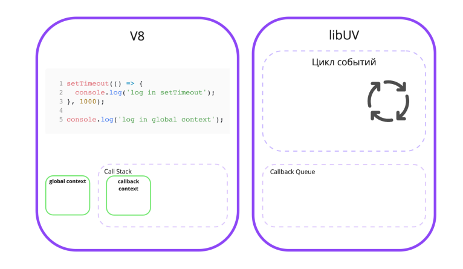
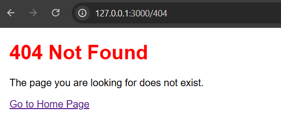

# introduction

Node.js is a platform that allows developers to write server-side programs in JavaScript. Node.js is not a programming language or a framework.

It is simply a tool that allows JavaScript code to run outside of the browser.

#### What is the difference between a web server and an HTTP server?

**A web server** is a set of programs that run web protocols, and a computer that processes all of this.

**An HTTP server** is a program running in an operating system that receives HTTP requests from clients (such as browsers) over the network and sends them HTTP responses containing data, such as HTML pages or JSON objects.

Thus, a web server is a broader concept than an HTTP server.

An HTTP server can be part of a web server, but not vice versa. A web server can contain several HTTP servers, for example, when you need to run two separate sites on one computer.

## Synchronous processing


The most understandable and simple implementation. All requests to the web server are executed sequentially.

For example, if three parallel requests are made to the web server, it will process the first request and then return the response, then proceed to execute the second request and return the response, and finally process the third request and return the response.

The downside of this approach is that each subsequent client in the queue will wait for the requests of the previous clients to be executed.

This approach may be useful in some situations, but in most cases it is unacceptable.

## Creating a separate process


This is also a fairly simple implementation. For each request, a separate process is launched in the operating system with the HTTP server code. This allows requests to be processed in parallel, so that each client does not have to wait while another client's requests are being processed.

The downside of this approach is that creating a separate process is a rather resource-intensive operation from the operating system's point of view.

## Create a separate thread


Processes in the operating system allow you to create a separate thread of code execution.

> 💡 A thread is a way of executing tasks in an operating system within a single process. When a process is running, it can have multiple threads, each of which performs a different task. Each thread can work with the same area of ​​memory, unlike processes, which cannot easily access the memory of another process. Threads are used to speed up program execution and improve its efficiency, since they allow several tasks to be performed at the same time.

This is a less resource-intensive operation than creating a separate process, but here there is a difficulty in memory management, since the memory area allocated by the operating system is common for threads within a single process.

Here it is necessary to prevent situations when two threads access, for example, the same variable and try to change it. For this purpose, in different programming languages ​​where this approach is used, memory management tools are implemented, which complicates the development of the application.

## Event-driven approach


An event-driven approach is one in which a program responds to events that occur in the system, rather than performing actions in a specific order. Rather than waiting for one operation to complete, the program can continue to run and wait for events to occur in the future. When an event occurs, the program responds to it and executes the appropriate code. This is where JavaScript comes in, which is asynchronous and event-driven by its very nature, because it was created for browsers, where code execution should not block the rendering of the interface.

In both the browser and Node.js, the code is executed in a single thread, which eliminates the need to think about memory access, as with the approach of creating separate threads per request. However, input/output operations (database request, file reading, HTTP request) are executed in parallel, which allows the application to work quickly.

## Execution context

**The execution context** is a mechanism that allows the interpreter to understand which variables and functions are currently available for use.
There are two execution contexts:

- **Global** - created when the script is launched. It contains all the variables and functions that we define in the script.
- **Function** context - created when the function is called. It contains the variables and functions that were defined inside the original function.

Let's look at an example:

```Javascript
const a = 10;
function foo() {
  const a = 5;
  console.log(a);
}
foo();

console.log(a);
```

Here's what we see in this code:

- The first line defines the constant a with the value 10.
- The third line defines the function foo().
- The fourth line in the function foo() redefines the constant a with the value 5.
- The fifth line prints the value of the constant a to the console
- The eighth line calls the function foo();
- The tenth line prints the value of the constant a to the console.

Two questions arise:

1. What value of the constant a will be output to the console on the fifth line?
2. What value of the constant a will be output to the console on the tenth line?

Answers:

1. On the fifth line - 5.
2. On the tenth line - 10.

Why did this happen? Because when calling the foo() function, the constant a was defined with the value 5. But such a constant already exists, and it was defined on the first line! No problem, since the function has its own context, in which any constants and variables can be written, even if they were defined with the same name in the global context. This is done for the convenience of programmers.

Otherwise, if there were no function call context, you would always have to think about the name of the variables in the entire project so that they do not overlap.

But how does the interpreter understand which context to use at each moment of script execution? There is a special mechanism for this - the call stack.

## Call stack

**A stack** is an abstract data type that represents a list of elements organized in a LIFO (last in, first out) manner, meaning that the last element added will be the first element removed. The most common comparison of a stack is to a stack of plates: there is a stack of three plates, and to take the second one, you must first take the third one.

**A call stack** is a mechanism for keeping track of the current context and order of function calls. Each time a function is called, it is added to the call stack. When a function completes, it is removed from the call stack.

To better understand how a call stack works, let's look at an example:

```Javascript
function foo() {
}

function baz() {
    foo();
}

baz();
```

The example defines two functions: foo() and baz(). The baz() function calls the foo() function. When the baz() function is called on the seventh line, the foo() function will be called next.

## How is the V8 interpreter related to the libUV library?

```Javascript
setTimeout(() => {
    console.log('Log in setTimeout');
}, 1000);

console.log('Log in global context');
```

This code initializes a timer that will execute the passed callback in one second. The callback displays the message "log in setTimeout" in the console.

After the timer is initialized, the message "log in global context" is displayed in the console.

In what order will the logs be displayed when we run this code? Those who know JavaScript will easily determine the order: first, we will see the message "log in global context" in the console, and after a second, "log in setTimeout" will appear in the console.

This is a clear and logical behavior in JavaScript, this happens because, after initializing the timer, the interpreter will immediately proceed to executing the console.log method on the fifth line, and then after the specified time, the callback in setTimeout will be executed, which will display the corresponding message in the console.

After this, the script execution will be completed.

setTimeout itself is not part of JavaScript. That is, V8 does not know anything about setTimeout. So where does it come from, and why can we use it? It's all about libUV.

When you run a script using Node.js, the V8 engine is initialized. It is passed various variables and functions that are not part of the interpreter, such as setTimeout. When we call setTimeout, we pass two arguments to it - a callback and the time after which the corresponding callback should be called. This is where the magic happens.

The address of the callback that we pass is sent to libUV along with the time after which this callback should be called. Then, libUV initializes a timer internally and constantly checks whether it is time to execute the callback.

This is exactly why V8 is free and can continue executing the code, because the timer is handled on the libUV side.

1. When the script is run, V8 and LibUV are initialized.


2. Next, the code execution begins. The setTimeout function is run, and the function call is added to the call stack.


3. As soon as the setTimeout function hits the call stack, all necessary data is passed to the libUV library - this is the address of the callback initialized in the first argument of setTimeout(), and the timer time from the second argument.


4. Then the setTimeout function finishes executing, and the function context is popped from the V8 call stack.

But what's going on in libUV?

It's worth explaining what an event loop is. An event loop is an infinite loop that runs as long as there are tasks to run in it.

In our case, a timer gets into the event loop, and the loop checks at each iteration whether the timer has reached the required time.


5. After setTimeout is executed, the log() function of the global console object is executed on line 5.

It is added to the call stack. Note that while the log() function is executing, the event loop contains a timer task that has not yet executed because the time has not come.


6. After the log() function on line 5 is executed, its context is popped from the event stack. There is nothing to execute in the code after that. But Node.js will not stop executing the script, since there is a registered task in the event loop. So what happens when the timer reaches the required
   time? The callback address will be passed to the Callback Queue.

The callback queue is needed to store the addresses of functions that need to be executed in the interpreter.


7. After the callback address is passed to the callback queue, libUV will check the call stack in V8. If it is empty (and only if it is empty), it will pass the function address to the call stack, and V8 will create a context for the callback and start executing the callback.


8. Next, since the callback function was called in the interpreter, the body of this function is executed and the log() function of the global console object is launched. This function is added to the call stack.


9. When the log() function is executed, its context is popped from the call stack.



10. After this, since there is no more code in the callback, the callback also completes its execution and is popped from the call stack.


11. Once the callback has completed executing, there is no more code to execute and no tasks in the event loop. The script terminates.

Quite complicated! To better understand how Node.js works, you can use Loupe, a tool for visualizing v8 and the [event loop](http://latentflip.com/loupe/?code=JC5vbignYnV0dG9uJywgJ2NsaWNrJywgZnVuY3Rpb24gb25DbGljaygpIHsKICAgIHNldFRpbWVvdXQoZnVuY3Rpb24gdGltZXIoKSB7CiAgICAgICAgY29uc29sZS5sb2coJ1lvdSBjbGlja2VkIHRoZSBidXR0b24hJyk7ICAgIAogICAgfSwgMjAwMCk7Cn0pOwoKY29uc29sZS5sb2coIkhpISIpOwoKc2V0VGltZW91dChmdW5jdGlvbiB0aW1lb3V0KCkgewogICAgY29uc29sZS5sb2coIkNsaWNrIHRoZSBidXR0b24hIik7Cn0sIDUwMDApOwoKY29uc29sZS5sb2coIldlbGNvbWUgdG8gbG91cGUuIik7!!!PGJ1dHRvbj5DbGljayBtZSE8L2J1dHRvbj4%3D). It was developed by programmer Philip Roberts. This tool allows you to write code and see what happens while it is running.

True, Roberts implemented visualization for JavaScript execution in the browser, but the principle of executing JavaScript in the browser and in Node.js is very similar. The only difference is that in the browser, instead of libUV, the WebAPI library works. You can also watch [Philip Roberts' video](https://www.youtube.com/watch?v=8aGhZQkoFbQ&t=49s), where he explains how the event loop works and talks about the Loupe visualization tool.

## Installing Node.js

Go to the official [website nodejs.org](https://nodejs.org/) and go to the DOWNLOADS section. There you will find the download link for the latest version of Node.js. You can download the installer for Windows or the zip file for Linux. The zip file is the easiest way to install Node.js.

Once Node.js is installed, you can check that it is working by running the command node -v in the terminal or command line. This command lets you know which version of Node.js is installed on your computer.

## How to run code with Node.js?

Node.js is installed, it's time to run JavaScript!

There are two ways to run Javascript code in Node.js - REPL and running a file with JS code. First, let's figure out what REPL is.

### REPL

REPL (Read-Eval-Print Loop) is an interactive shell for executing code in Node.js in the console. REPL allows you to enter JavaScript expressions and get their results.

To start REPL, open a terminal and type node without any arguments. You will see a prompt, which is indicated by the > symbol.

Now you can enter JavaScript expressions and press Enter to execute them. For example, let's try to add two numbers:

```Javascript
> 1 + 2
3
```

The REPL keeps the values ​​of variables in memory until we close the shell. This means that we can use variables in different expressions. For example, let's multiply x by y:

```Javascript
> x = 1;
> y = 2;
> x * y
2
```

If we want to see the value of a variable, we can simply type its name:

```Javascript
> x
1
```

The REPL also allows you to use various JavaScript functions and objects.

For example, let's try using the Math.pow function to raise a number to a power:

```Javascript
> Math.pow(2, 3)
8
```

### Running JavaScript files

Now let's try to run a JavaScript file in Node.js. To do this, you need to create a file in any directory with the .js extension.

In Linux and MacOS, this can be done via the terminal with the touch command, followed by a space and the file name.

```bash
touch example.js
```

In Node.js, there is a console object with a log method to output data to the console, just like in the browser. Let's write the following line to the file:

```Javascript
console.log('Hello, world!');
```

Now let's run the file using the node command:

```bash
node ./example.js
```

Let's try working with more complex code. For example, let's try to add up all the numbers in the array and output the result to the console:

```Javascript
let array = [1, 2, 3, 4, 5];
let sum = 0;
for (let i = 0; i < array.length; i++) {
  sum += array[i];
}
console.log(sum);
```

As you can see, Node.js runs regular JavaScript code just like in a browser. But it is important to understand that Node.js has built-in specific objects and functions that will not be available in a browser. And vice versa, the browser has special objects and functions that Node.js does not have.

For example, the browser has a global window object for interacting with the browser, but you will not find it in Node.js, since Node.js does not have a window, and functions such as alert or the navigation object do not make sense in the context of Node.js. The equivalent of such an object in Node.js is the global object global.

## HTTP server on Node.js

First of all, we need to create a file in which we will write the server code.

Let's call it index.js. After that, we can start writing the code.

Let's look at an example of code that creates and runs a simple HTTP server:

```Javascript
const http = require('http');

const hostname = '127.0.0.1';
const port = 3000;

const server = http.createServer((req, res) => {
    res.statusCode = 200;
    res.setHeader('Content-Type', 'text/plain');
    res.end('Hello, World!\n');
});

server.listen(port, hostname, () => {
    console.log(`Server running at http://${hostname}:${port}/`);
});
```


> 💡 To enable computers to communicate effectively over a network, the concept of ports was invented, which allows several programs to run on one computer, and each program can receive requests from the network independently of each other. A port is a unique address of a program on a computer for working on a network. Thus, to make a request to a specific program on a computer, you need to specify the IP address of the computer and, after a colon, specify the port that the program is listening on. For example: 192.32.44.33:3000. Operating systems can use 65535 ports. Some ports are reserved by the operating system for utility programs. For example, port 9100 is usually reserved for working with printers. But the overwhelming majority of ports are available for free use.

### How to send HTTP responses using res object?

The res object in the callback represents the HTTP response that we can send to the client in response to its HTTP request. The res object has various properties and
methods that allow us to control the content and format of the response.

Let's look at some of them:

- The res.writeHead() method allows you to set response headers - metadata that is transmitted along with the response data and contains information about its
  type, size, encoding, and other characteristics. The res.writeHead() method
  takes two arguments: - Status code - a number that indicates the result of the server's processing of the request. For example, code 200 means a successful response, and code 404 means that the requested resource was not found. - Headers object - an object that contains key-value pairs, where the key is the header name and the value is the header value. For example, {‘Content-Type’: ‘text/html’} means
  that the response data type is HTML text.
- The res.end() method allows you to finish sending the response. This method takes
  one optional argument: data. - Data is a string or buffer containing the response data that we want to send to the client. For example, ‘<h1>Hello world!</h1>’ means that we want to send HTML text with the title
  “Hello world!”. If we do not pass the data argument to the res.end() method, we send an empty response.

Let’s change our code so that the server sends an HTTP response with HTML text:

```Javascript
const http = require('http');

const hostname = '127.0.0.1'; // Or '0.0.0.0' for access from other devices
const port = 3000;

const server = http.createServer((req, res) => {
    // Set the response HTTP header with HTTP status and Content type
    res.writeHead(200, { 'Content-Type': 'text/html' });

    // Send the response body as HTML
    res.end(`
        <!DOCTYPE html>
        <html lang="en">
        <head>
            <meta charset="UTF-8">
            <meta name="viewport" content="width=device-width, initial-scale=1.0">
            <title>My Node.js Server</title>
            <style>
                body {
                    font-family: Arial, sans-serif;
                    margin: 20px;
                }
                h1 {
                    color: #333;
                }
                p {
                    font-size: 16px;
                }
            </style>
        </head>
        <body>
            <h1>Welcome to My Node.js Server!</h1>
            <p>This is a simple HTML response from a Node.js server.</p>
            <p>You can modify this HTML to display any content you like.</p>
        </body>
        </html>
    `);
});

// Start the server
server.listen(port, hostname, () => {
    console.log(`Server running at http://${hostname}:${port}/`);
});
```


### How to handle different request paths?

But what if we want to make two different pages? For example:

1. http://localhost:3000/home
2. http://localhost:3000/about

It's pretty simple! When we receive a request and our request handler is run, we can always find out which path in the address bar was passed. Paths in the address bar are also called routes. Let's look at the final code and break it down:

```Javascript
const http = require('http');

const hostname = '127.0.0.1'; // Or '0.0.0.0' for access from other devices
const port = 3000;

const server = http.createServer((req, res) => {
    // Get the URL path from the request
    const path = req.url;

    // Set the default response code
    res.writeHead(200, { 'Content-Type': 'text/html' });

    // Route handling
    if (path === '/home') {
        res.end(`
            <!DOCTYPE html>
            <html lang="en">
            <head>
                <meta charset="UTF-8">
                <meta name="viewport" content="width=device-width, initial-scale=1.0">
                <title>Home Page</title>
                <style>
                    body { font-family: Arial, sans-serif; margin: 20px; }
                    h1 { color: #333; }
                </style>
            </head>
            <body>
                <h1>Welcome to the Home Page!</h1>
                <p>This is the home page of our simple Node.js server.</p>
                <a href="/about">Go to About Page</a>
            </body>
            </html>
        `);
    } else if (path === '/about') {
        res.end(`
            <!DOCTYPE html>
            <html lang="en">
            <head>
                <meta charset="UTF-8">
                <meta name="viewport" content="width=device-width, initial-scale=1.0">
                <title>About Page</title>
                <style>
                    body { font-family: Arial, sans-serif; margin: 20px; }
                    h1 { color: #333; }
                </style>
            </head>
            <body>
                <h1>About Us</h1>
                <p>This page provides information about our Node.js server.</p>
                <a href="/home">Go to Home Page</a>
            </body>
            </html>
        `);
    } else {
        // Handle 404 Not Found
        res.writeHead(404, { 'Content-Type': 'text/html' });
        res.end(`
            <!DOCTYPE html>
            <html lang="en">
            <head>
                <meta charset="UTF-8">
                <meta name="viewport" content="width=device-width, initial-scale=1.0">
                <title>404 Not Found</title>
                <style>
                    body { font-family: Arial, sans-serif; margin: 20px; }
                    h1 { color: red; }
                </style>
            </head>
            <body>
                <h1>404 Not Found</h1>
                <p>The page you are looking for does not exist.</p>
                <a href="/home">Go to Home Page</a>
            </body>
            </html>
        `);
    }
});

// Start the server
server.listen(port, hostname, () => {
    console.log(`Server running at http://${hostname}:${port}/`);
});
```


The req request object has a url field that stores a string with the value of the route that was passed during the request from the browser. In this way, we can process any routes, including routes like /home/prices, if, for example, we need to make a subpage of our main page.

### 404 Not Found

If we want to handle 404 Not Found, we can do it in the same way as in the previous example. We can use the res.writeHead() method to set the response code and the res.end() method to send the response body.

```Javascript
const http = require('http');

const hostname = '127.0.0.1'; // Или '0.0.0.0' для доступа с других устройств
const port = 3000;

const server = http.createServer((req, res) => {
    // Получаем путь URL из запроса
    const path = req.url;

    // Обработка маршрутов
    if (path === '/home') {
        res.writeHead(200, { 'Content-Type': 'text/html' });
        res.end(`
            <!DOCTYPE html>
            <html lang="en">
            <head>
                <meta charset="UTF-8">
                <meta name="viewport" content="width=device-width, initial-scale=1.0">
                <title>Home Page</title>
                <style>
                    body { font-family: Arial, sans-serif; margin: 20px; }
                    h1 { color: #333; }
                </style>
            </head>
            <body>
                <h1>Welcome to the Home Page!</h1>
                <p>This is the home page of our simple Node.js server.</p>
                <a href="/about">Go to About Page</a>
            </body>
            </html>
        `);
    } else if (path === '/about') {
        res.writeHead(200, { 'Content-Type': 'text/html' });
        res.end(`
            <!DOCTYPE html>
            <html lang="en">
            <head>
                <meta charset="UTF-8">
                <meta name="viewport" content="width=device-width, initial-scale=1.0">
                <title>About Page</title>
                <style>
                    body { font-family: Arial, sans-serif; margin: 20px; }
                    h1 { color: #333; }
                </style>
            </head>
            <body>
                <h1>About Us</h1>
                <p>This page provides information about our Node.js server.</p>
                <a href="/home">Go to Home Page</a>
            </body>
            </html>
        `);
    } else {
        // Обработка 404 Not Found
        res.writeHead(404, { 'Content-Type': 'text/html' });
        res.end(`
            <!DOCTYPE html>
            <html lang="en">
            <head>
                <meta charset="UTF-8">
                <meta name="viewport" content="width=device-width, initial-scale=1.0">
                <title>404 Not Found</title>
                <style>
                    body { font-family: Arial, sans-serif; margin: 20px; }
                    h1 { color: red; }
                </style>
            </head>
            <body>
                <h1>404 Not Found</h1>
                <p>The page you are looking for does not exist.</p>
                <a href="/home">Go to Home Page</a>
            </body>
            </html>
        `);
    }
});

// Запуск сервера
server.listen(port, hostname, () => {
    console.log(`Server running at http://${hostname}:${port}/`);
});
```


